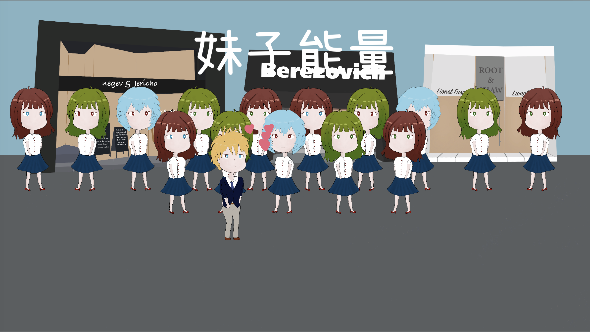
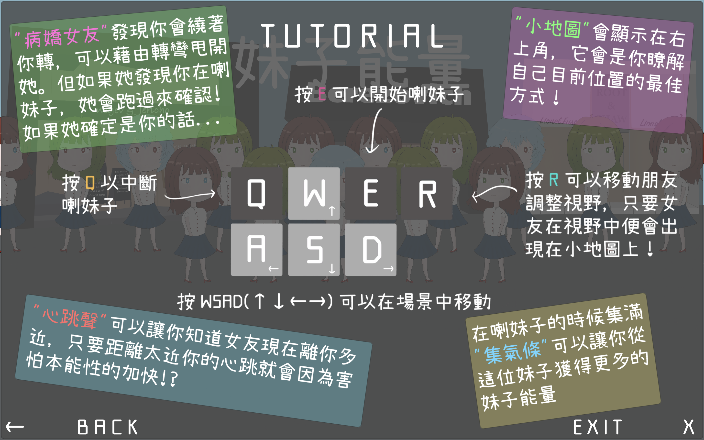

# Girls' Energy

NTU Game Programming 2018 term project

## Introduction

- 在遊戲中，玩家將扮演一個需要喇妹子獲取妹子能量才能活下去的人。雖然主角有一個女朋友，但交往之後他才發現她是一個很可怕的病嬌，他沒有辦法從她身上獲取妹子能量。因為被她發現你在喇妹子，就 Nice Boat 了，所以要在不被她發現的前提下，盡可能的獲取妹子能量活下去。
- 影片: [https://youtu.be/w5NGIImEPgM][8]

## Binary

[https://drive.google.com/drive/folders/1VMrSUIHZOJ7oGvUJDK0XsztcFSJ0yMwI?usp=sharing][7]

## Tutorial

## Members & Division of Works

c88tm: Girls NPC spawn & Destroit Effect, Energy Bar, Camera Moving Algotiyhm, Scene Transition, Girlfriend's strategy, Map Algorithm.

zakmit: Scene Arrangement, UI(Menu, Setting, Tutorial ...), All Sprites, Animations, Place Music, Player Script, Girls NPC Prototype, Timer, Friend System, Levels Setting, Special Effect, Progress Bar, Ending Scripts.

## Materials

### Fonts

- Mamelon: [https://moji-waku.com/mamelon/index.html][1]
- Seto Font: [https://zh-tw.osdn.net/projects/setofont/][2]
- Zpix: [https://github.com/SolidZORO/zpix-pixel-font][3]

### Music & SE

- Universal Sound FX: [https://assetstore.unity.com/packages/audio/sound-fx/universal-sound-fx-17256][4]
- Ultimate Game Music Collection:: [https://assetstore.unity.com/packages/audio/music/orchestral/ultimate-game-music-collection-37351][5] 
- Careless Whisper: [https://www.youtube.com/watch?v=8s6xmolPuUo][6]

[1]: https://moji-waku.com/mamelon/index.html
[2]: https://zh-tw.osdn.net/projects/setofont/
[3]: https://github.com/SolidZORO/zpix-pixel-font
[4]: https://assetstore.unity.com/packages/audio/sound-fx/universal-sound-fx-17256
[5]: https://assetstore.unity.com/packages/audio/music/orchestral/ultimate-game-music-collection-37351
[6]: https://www.youtube.com/watch?v=8s6xmolPuUo
[7]: https://drive.google.com/drive/folders/1VMrSUIHZOJ7oGvUJDK0XsztcFSJ0yMwI?usp=sharing
[8]: https://youtu.be/w5NGIImEPgM